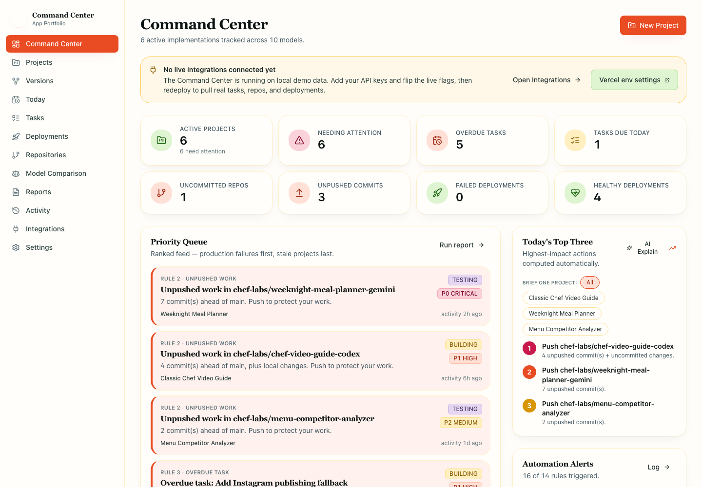
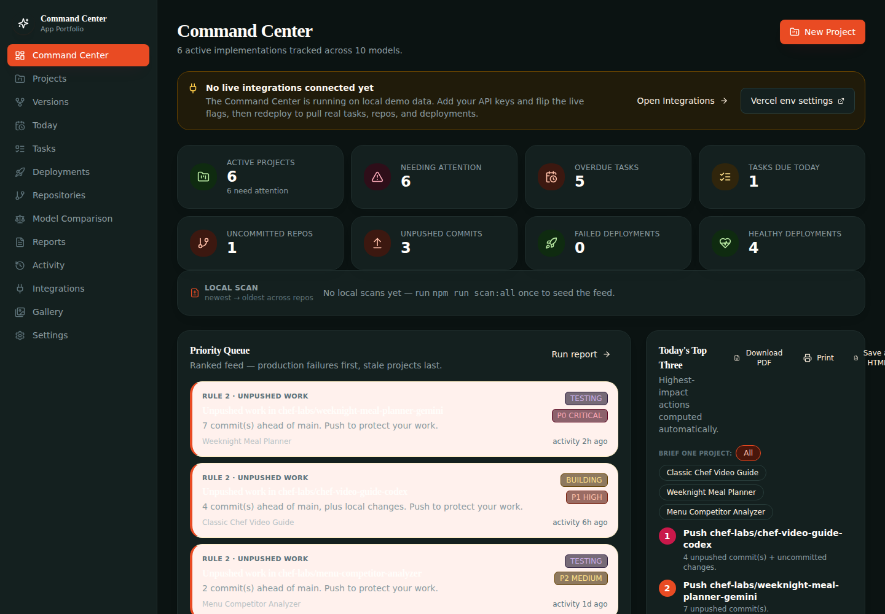
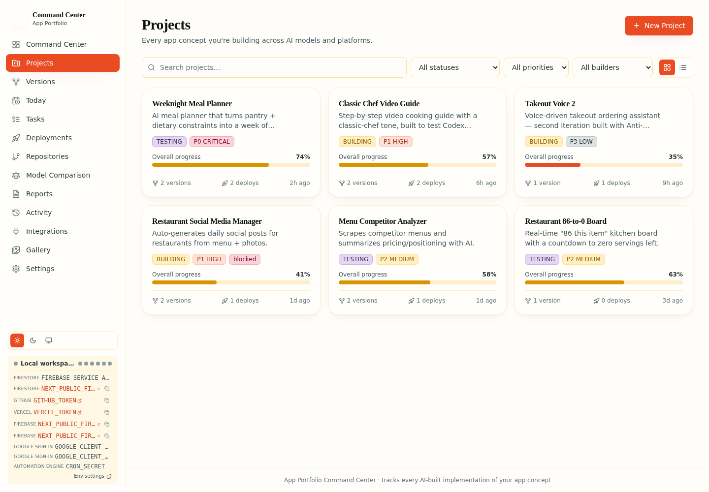
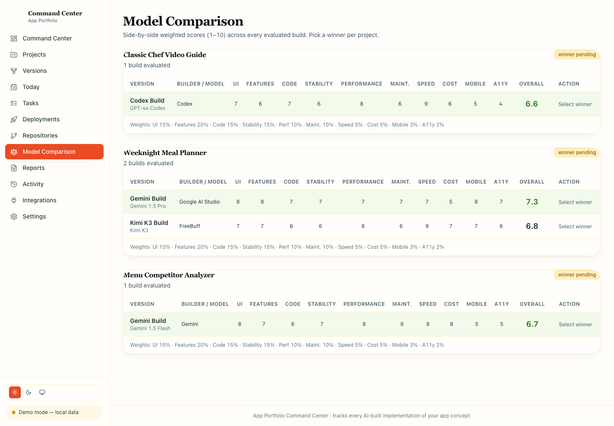

<div align="center">

# 🍳 App Portfolio Command Center

**One dashboard to run every AI-built version of your app idea.**

[](https://portfolio-app-freebuff.vercel.app)
[](https://github.com/LCHEROURI/portfolio-app-freebuff/actions/workflows/ci.yml)
[](https://nextjs.org)
[](https://www.typescriptlang.org)
[](https://firebase.google.com)
[](https://tailwindcss.com)

**[Live demo →](https://portfolio-app-freebuff.vercel.app)** · No sign-up needed — runs in demo mode with seeded data.

</div>

---

## What it is

A solo developer doesn't build one app — they build the **same idea many times**,
once per AI model and platform: Gemini, DeepSeek, Lovable, Replit, Kimi K3,
Claude, Cursor, Codex, ChatGPT, Google AI Studio, Anti-Gravity, FreeBuff…

**App Portfolio Command Center** turns that chaos into a single, ranked,
actionable dashboard. Each business concept is a **Project**; each AI build of
it is a **ProjectVersion**. Repositories, deployments, tasks, model
evaluations, automated alerts, and daily/weekly reports all live in one
desktop-first view.

## Screenshots

| Command Center | Command Center (dark) |
| :---: | :---: |
|  |  |

| Project portfolio | Model comparison |
| :---: | :---: |
|  |  |

> Try the live demo in dark mode: `https://portfolio-app-freebuff.vercel.app/command-center?theme=dark`

## Why it's a portfolio piece

- **A real engine, not a mockup** — the 8-tier priority queue, all **14
  automation rules**, "Today's Top Three", and daily/weekly report builders are
  implemented and running (`lib/engine.ts`).
- **Data-backed model selection** — every version is scored across 10 weighted
  axes (UI, features, code quality, stability, performance, maintainability,
  speed, cost, mobile, accessibility) so "which build won?" has an answer.
- **Production-ready data layer** — typed, user-isolated Firestore with real
  Authentication (email/password + Google), a `firestore.rules` security model,
  and a one-click **migration path** from the localStorage demo mode into a
  real account.
- **Ships with a local companion** — `scripts/repo-scanner.mjs` reads your git
  state locally and POSTs metadata (never source) to the scanner API, so repos
  show up in the dashboard.
- **Runs out of the box** — seeded with 6 realistic demo projects; no Firebase
  config required to explore every screen.

## Stack

- **Frontend:** Next.js 14 (App Router), React 18, TypeScript
- **Styling:** Tailwind CSS, Lucide icons, light/dark/system themes (`?theme=` URL override)
- **Data:** Firebase Auth + Cloud Firestore (typed, user-isolated, `firestore.rules`) with a fully functional **local demo fallback** (localStorage) — local demo data can be **imported into a real account** on first sign-in
- **Automation:** 14-rule engine + priority queue + "Today's Top Three", fired by a Vercel Cron (`/api/cron/reports`) that emails daily/weekly reports against live data
- **Integrations:** GitHub REST, Vercel API, Google Calendar, Gemini AI summaries

## Getting started

```bash
npm install
npm run dev          # http://localhost:3000
```

Open http://localhost:3000 → redirected to `/command-center`. The app seeds 6
demo projects (Classic Chef Video Guide, Weeknight Meal Planner, Restaurant
Social Media Manager, Restaurant 86-to-0 Board, Menu Competitor Analyzer,
Takeout Voice 2) and persists changes to localStorage in demo mode.

### Opt into Firebase (real Auth + Firestore)

Create a `.env.local` with your Firebase web-app config values:

```bash
NEXT_PUBLIC_FIREBASE_API_KEY=…
NEXT_PUBLIC_FIREBASE_PROJECT_ID=…
NEXT_PUBLIC_FIREBASE_AUTH_DOMAIN=…
NEXT_PUBLIC_FIREBASE_STORAGE_BUCKET=…
NEXT_PUBLIC_FIREBASE_MESSAGING_SENDER_ID=…
NEXT_PUBLIC_FIREBASE_APP_ID=…
```

When these are present the app switches to real Authentication + Firestore:

- A **sign-in gate** appears (`components/auth/AuthGate.tsx`) — email/password
  or Google (popup). Authentication lives in `lib/auth.tsx`.
- Every read/write is scoped by `userId` via `lib/firestore.ts`, and
  `firestore.rules` enforces the same per-user isolation server-side.
- On first sign-in the app offers to **import your local demo data** into the
  account (`migrateLocalDemoToFirestore` in `lib/firestore.ts`) — projects,
  versions, repos, deployments, tasks, evaluations, and activity are re-keyed
  to your uid and written to Firestore.
- Sign out from the sidebar footer or Settings → Account.

Deploy the rules with:

```bash
npx firebase deploy --only firestore:rules
```

In **Demo Mode** (no env vars) everything still works: seeded data persists to
localStorage and the app never asks for credentials.

### 🔌 Live integrations — Supabase · GitHub · Vercel

The Command Center ships with a **live-data layer** that replaces demo
placeholder data with your real services. Each integration is toggled by a
`NEXT_PUBLIC_LIVE_*` flag plus a matching server-side credential; if a
credential is missing the app falls back to local demo data, so every screen
stays usable.

| Source | Feeds | Flag | Server env |
| --- | --- | --- | --- |
| **Supabase** | `Today` + `Tasks` + `Projects`/`Versions` — tasks, reminders, projects, versions & evaluations persisted to Postgres (the tables the automation cron reads) | `NEXT_PUBLIC_LIVE_TASKS=1`, `NEXT_PUBLIC_LIVE_PROJECTS=1` | `SUPABASE_URL`, `SUPABASE_SERVICE_ROLE_KEY` |
| **GitHub** | `Repositories` — branches, latest commit, PRs, issues, workflow status | `NEXT_PUBLIC_LIVE_REPOS=1` | `GITHUB_TOKEN`, `GITHUB_OWNER`, `GITHUB_REPOS` |
| **Vercel** | `Deployments` — latest deploy per project + live health checks (HTTP status + response time) | `NEXT_PUBLIC_LIVE_DEPLOYMENTS=1` | `VERCEL_TOKEN`, `VERCEL_TEAM_ID` |

**Setup (full detail in `.env.example`):**

1. **Supabase** — create a project, run `supabase/schema.sql` in the SQL editor
   (creates `tasks`, `reminders`, `projects`, `versions` and `evaluations`
   tables with owner-scoped RLS), then add the project URL + service-role key
   to your env. Set `NEXT_PUBLIC_LIVE_PROJECTS=1` to persist projects/versions/
   evaluations there as well.
2. **GitHub** — create a fine-grained PAT (repo read). Owner defaults to
   `LCHEROURI`; the repo list defaults to your 7 active repos and is
   overridable via `GITHUB_REPOS`.
3. **Vercel** — create an API token (Account → Tokens). Projects default to
   `GITHUB_REPOS` (or set `VERCEL_PROJECTS`).
4. Flip the matching `NEXT_PUBLIC_LIVE_*` flag to `1` and redeploy.

**Connection status panel** — the **Integrations** page live-polls `/api/status`
(every 30s + manual refresh) and shows, per integration: exactly which env
vars are set (✓/✗, booleans only — values are never exposed) and a live
endpoint ping with HTTP status + latency (Supabase PostgREST, GitHub
`rate_limit`, Vercel `v2/user`, Firebase projects API, and the automation
engine). Pings are cached server-side for 2 minutes (successful responses
only — failures retry immediately), so polling never hammers provider APIs;
the Refresh button bypasses the cache with `?refresh=1`. Same Firebase-token
auth as every other live route.

> **Auth model:** every live API route is owner-scoped by a **cryptographically
> verified Firebase ID token** (`Authorization: Bearer <idToken>`, RS256-verified
> against Google's public certs — see `lib/server/firebase-token.ts`). The old
> `x-app-user` header is ignored server-side whenever Firebase is configured, so
> it can no longer be spoofed to read or write another user's rows. In demo mode
> (no Firebase env vars) the header is still used — there is no token issuer and
> the data is per-browser local.

> **Local git state:** unpushed commits and uncommitted changes exist only on
> your machine, so the GitHub API can't see them. The **repo scanner CLI**
> (`npm run scanner`) reports those and the store overlays them onto the live
> GitHub feed (see `mergeScannerOverlay` in `lib/store.tsx`).

### 🤖 Automation Engine — scheduled daily/weekly report emails

The 14 rules aren't just a dashboard widget — a **Vercel Cron job**
(`vercel.json` → `/api/cron/reports`) evaluates them against the **live data**
(Supabase tasks/projects/versions/evaluations, live GitHub repos, Vercel/
Firebase deployments with health checks) and emails you a report:

- **Daily (07:00 UTC):** attention items, overdue + due-today + completed-
yesterday tasks, failed deployments, unpushed commits, priority queue, and
"Today's Top Three" actions.
- **Weekly (07:00 UTC every Monday, or `REPORT_WEEKLY_DAY`):** projects advanced,
deployment health, model performance breakdown, and winner recommendations.

**Setup:**

```bash
# 1. Add to Vercel → Project → Settings → Environment Variables:
CRON_SECRET=<long-random-string>   # Vercel Cron sends this as the auth header
RESEND_API_KEY=<resend-key>        # https://resend.com
REPORT_EMAIL=you@example.com       # inbox that receives the reports

# 2. Optional: REPORT_OWNER_ID (default demo-user), REPORT_WEEKLY_DAY (1=Mon),
#    REPORT_STALE_DAYS (7), REPORT_FROM

# 3. Redeploy — Vercel registers the cron from vercel.json automatically.
```

The route returns `401` without the `Authorization: Bearer <CRON_SECRET>`
header, so it can't be triggered by the public. Test a run manually:

```bash
curl -H "Authorization: Bearer $CRON_SECRET" \
  "https://portfolio-app-freebuff.vercel.app/api/cron/reports?kind=daily"
```

It skips emailing while no live sources are wired (nothing to report), and each
report is also visible in the Vercel cron invocation logs.

### Local Repository Scanner companion

```bash
node scripts/repo-scanner.mjs --path ~/dev/my-app --api http://localhost:3000/api/scanner
```

The CLI reads `git status --porcelain`, `git remote -v`, `git branch
--show-current`, `git log -1` and `git rev-list --left-right --count`, then
POSTs **metadata only** (never source code) to the Command Center API.

### Cloud Functions (optional)

```bash
cd functions
npm install
npm run serve   # emulator
npm run deploy
```

Scheduled functions: `runAutomation` (every 6h), `generateDailyReports` (daily
08:00 UTC), `generateWeeklyReports` (Monday 09:00 UTC). On-demand endpoints:
`/healthCheck`, `/runAutomationNow`, `/ingestScannerReport`.

## Modules

| Route | Purpose |
| --- | --- |
| `/command-center` | Metric cards, ranked priority queue, Today's Top Three, alerts, stale watch |
| `/projects` | Filterable portfolio (grid/table), project create/edit modal |
| `/projects/[id]` | Detail tabs: Overview, Versions, Tasks, Repos, Deployments, Evaluation, Activity |
| `/versions` | All builds across projects |
| `/today` | Top three, due today, overdue, reminders, recently completed |
| `/tasks` | Kanban board + list view |
| `/deployments` | Health + status of every environment |
| `/repositories` | Repo cards + scanner instructions |
| `/model-comparison` | Weighted score matrix + winner selection |
| `/reports` | Generate/save daily & weekly reports |
| `/activity` | Event feed with kind filters |
| `/integrations` | GitHub / Vercel / Calendar / Gemini connection UI |
| `/settings` | Profile, report schedule, stale threshold, demo reset |

## Model Evaluation scoring

Overall = 0.15·UI + 0.20·Features + 0.15·Code + 0.15·Stability + 0.10·Perf +
0.10·Maint + 0.05·Speed + 0.05·Cost + 0.03·Mobile + 0.02·A11y (1–10 scale).

## Project layout

```
app/            Next.js App Router pages + API route (scanner ingest)
components/     Layout shell, auth gate, modals, UI kit
lib/            firebase.ts, auth.tsx, firestore.ts, seed.ts, engine.ts,
                store.tsx (React context), liveData.ts (live API facade),
                theme.tsx
app/api/        Live API routes: tasks, reminders, projects, versions,
                evaluations, repos (GitHub), deployments (Vercel + health
                checks), scanner, cron/reports (automation engine)
lib/server/     github.ts, deployments.ts, supabase.ts, rows.ts,
                reporting/ (data assembly + email)
supabase/       schema.sql — tasks, reminders, projects, versions,
                evaluations tables with RLS
types/          Full domain model + zod schemas + scoring
scripts/        repo-scanner.mjs (local CLI companion)
functions/      Firebase Cloud Functions (automation + scheduled reports)
firestore.rules Per-user Firestore security rules
screenshots/    Screenshots used in this README
```
